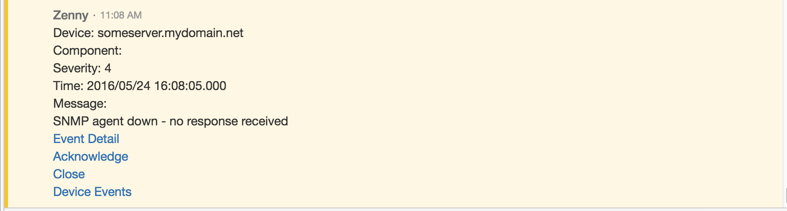
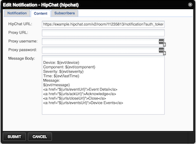

# HipChat - Zenoss Integration
A HipChat integration to show events from Zenoss.

Example:

To use:
* Install the ZenPack using  zenpack--install=PATH_TO_EGG
* In HipChat, create a new "Build your own" integration, give it a name and copy the URL for the integration. 
* In Zenoss, add a new Notification using the HipChat option.
* Use the URL you just copied as the HipChat URL under the content tab

* The message content can be customized using the "Message Body" field
	The message body uses the same TALEs expressions that notifications like email use.
* Update the zopeurl setting for zenactiond to properly set the links in the HipChat message
